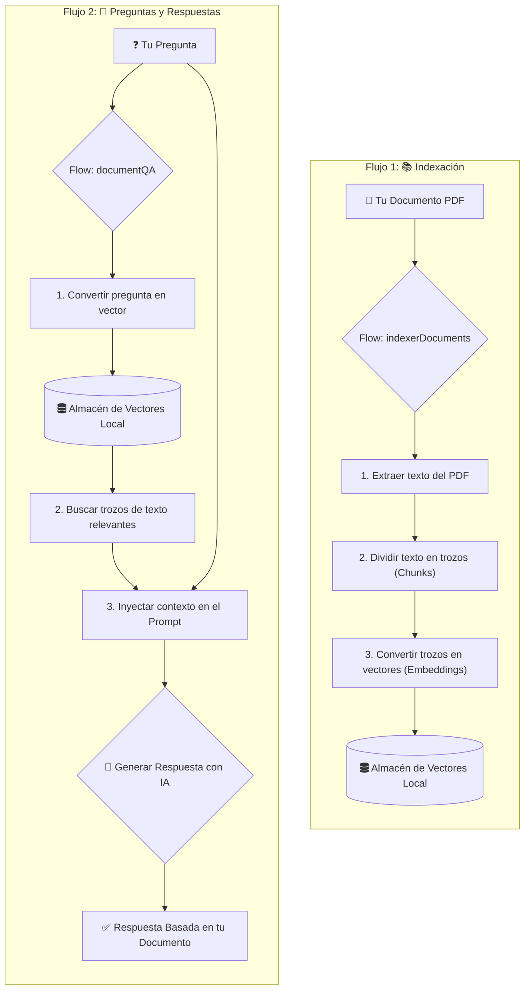

# 🤖 Sistema RAG con Genkit para Consultar Cualquier PDF

¡Bienvenido! Este proyecto es una plantilla poderosa y fácil de usar para construir un sistema de **Búsqueda y Generación Aumentada (RAG)** con el framework [Genkit de Google](https://genkit.dev/).

Te permite crear un "ChatGPT" personalizado que responde preguntas basándose exclusivamente en el contenido de **cualquier documento PDF** que le proporciones.

## ✨ Características Principales

-   **Anti-Alucinaciones**: La IA está forzada a responder solo con la información del documento. ¡No más respuestas inventadas!
-   **Fácil de Usar**: Dos flujos simples para indexar tu PDF y luego hacer preguntas.
-   **Personalizable**: Adaptado para que puedas usarlo con tus propios documentos y necesidades.
-   **Desarrollo Rápido**: Aprovecha la increíble UI de desarrollo de Genkit para prototipar y depurar.

##  diagrama de Flujo 🗺️



## 🚀 Empezando

### Requisitos Previos

-   [Node.js](https://nodejs.org/) (v20 o superior)
-   [Google Cloud SDK](https://cloud.google.com/sdk/docs/install) (gcloud CLI)
-   Un proyecto de Google Cloud con **Facturación Habilitada**.
-   Una **API Key de Google AI** (para el modelo Gemini).

### Pasos de Configuración

1.  **Clonar el Repositorio**
    ```bash
    git clone https://github.com/TU_USUARIO/TU_REPOSITORIO.git
    cd TU_REPOSITORIO
    ```

2.  **Instalar Dependencias**
    ```bash
    npm install
    ```

3.  **Configurar Google Cloud**
    Asegúrate de que tu `gcloud` CLI esté autenticado y apunte a tu proyecto.

    ```bash
    gcloud auth login
    gcloud auth application-default login
    gcloud config set project TU-PROJECT-ID
    gcloud services enable aiplatform.googleapis.com
    ```
    > ⚠️ **Importante**: Recuerda reemplazar `TU-PROJECT-ID` con tu ID de proyecto de Google Cloud, tanto aquí como en el archivo `src/main.ts`.

4.  **Crear Archivo de Entorno (`.env`)**
    Crea un archivo `.env` en la raíz y añade tu API Key de Gemini.

    ```env
    # Obtén tu clave desde https://makersuite.google.com/app/apikey
    GEMINI_API_KEY="AIz..."
    ```

## 💻 Uso

1.  **Iniciar Genkit**
    Este comando levanta la UI de desarrollo de Genkit, tu centro de operaciones.
    ```bash
    npx genkit start -- npx tsx --watch src/main.ts
    ```
    -   **UI de Flujos**: `http://localhost:4000`
    -   **Servidor de Telemetría**: `http://localhost:4033`

2.  **Paso 1: Indexar tu PDF**
    -   Abre la [UI de Genkit](http://localhost:4000).
    -   Selecciona el flujo `indexerDocuments`.
    -   En el campo "Input", escribe la ruta a tu archivo PDF (ej: `./mi-documento.pdf`).
    -   ¡Haz clic en **Run**! Tu documento ahora está en la memoria del sistema.

3.  **Paso 2: Hazle Preguntas**
    -   En la misma UI, selecciona el flujo `documentQA`.
    -   En "Input", escribe tu pregunta sobre el documento.
    -   ¡Haz clic en **Run** y obtén una respuesta basada en el contenido!

## 🤝 Contribuciones

¡Las contribuciones son bienvenidas! Si tienes ideas para mejorar esta plantilla, por favor abre un issue o envía un pull request. 